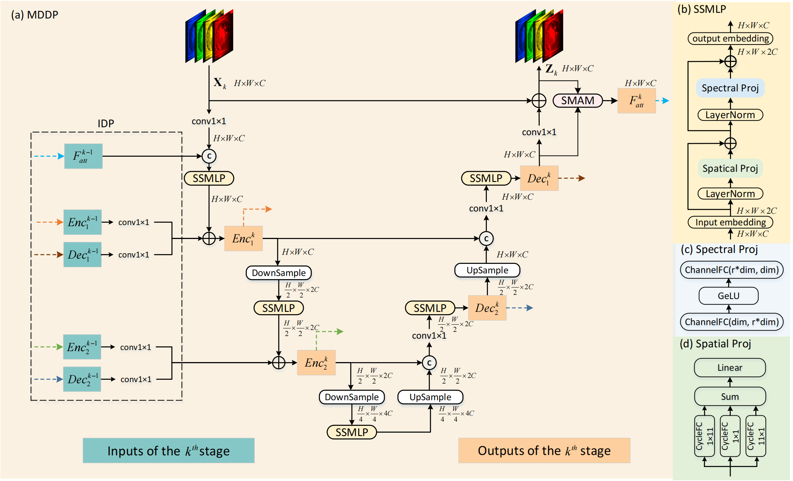

# MFMLP
This is the codes of Multu-stage Fusion MLP for Compressive Spectral Imaging

## Contents

1. [Comparison with State-of-the-art Methods](# Comparison with State-of-the-art Methods)
2. [Architecture](#Architecture)
3. [Dataset](#Dataset)
4. [Simulation Experiement](#Simulation Experiement)
5. [Real Experiement](#Real Experiement)
6. [Acknowledgements](#Acknowledgements)
7. [Contact](#Contact)

## 1. Comparison
<p align="center">

</p>
Fig. 1 PSNR-Params-FLOPs comparisons of our MFMLP and SOTA methods. The vertical axis is PSNR(dB), the horizontal axis is FLOPs(G), and the circle area is Params(M).

## 2. Architecture
<p align="center">

</p>
Fig. 2 The architecture of MFMLP with K stages(iterations).



Fig. 3 The overall architecture of MDDP. (a) MDDP adopts a U-shape structure. The green blocks are the input features of the kth stage, and also the output features of the (k − 1)th stage; the orange blocks are the output features of the kth stage, and also the input features of the (k + 1)th stage. (b)
SSMLP is composed of a Spatial Projection, a Spectral Projection, an input embedding, an output embedding, and two layer normalization. (c) Components
of Spectral Projection. (d) Components of Spatial Projection

## 3. Dataset
-cave_1024_28 ([Baidu Disk](https://pan.baidu.com/s/1X_uXxgyO-mslnCTn4ioyNQ), code: `fo0q` | [One Drive](https://bupteducn-my.sharepoint.com/:f:/g/personal/mengziyi_bupt_edu_cn/EmNAsycFKNNNgHfV9Kib4osB7OD4OSu-Gu6Qnyy5PweG0A?e=5NrM6S)),
-CAVE_512_28 ([Baidu Disk](https://pan.baidu.com/s/1ue26weBAbn61a7hyT9CDkg), code: `ixoe` | [One Drive](https://mailstsinghuaeducn-my.sharepoint.com/:f:/g/personal/lin-j21_mails_tsinghua_edu_cn/EjhS1U_F7I1PjjjtjKNtUF8BJdsqZ6BSMag_grUfzsTABA?e=sOpwm4)),
-KAIST_CVPR2021 ([Baidu Disk](https://pan.baidu.com/s/1LfPqGe0R_tuQjCXC_fALZA), code: `5mmn` | [One Drive](https://mailstsinghuaeducn-my.sharepoint.com/:f:/g/personal/lin-j21_mails_tsinghua_edu_cn/EkA4B4GU8AdDu0ZkKXdewPwBd64adYGsMPB8PNCuYnpGlA?e=VFb3xP)), 
-simu_mask and KAIST_10 from TSA_simu_data ([Baidu Disk](https://pan.baidu.com/s/1LI9tMaSprtxT8PiAG1oETA), code: `efu8` | [One Drive](https://1drv.ms/u/s!Au_cHqZBKiu2gYFDwE-7z1fzeWCRDA?e=ofvwrD)), 
-simu_mask and Measurements from TSA_real_data ([Baidu Disk](https://pan.baidu.com/s/1RoOb1CKsUPFu0r01tRi5Bg), code: `eaqe` | [One Drive](https://1drv.ms/u/s!Au_cHqZBKiu2gYFTpCwLdTi_eSw6ww?e=uiEToT)), and then put them into the corresponding folders of `datasets/` and recollect them as the following form:

```shell
|--MFMLP
    |--real——experiment
    |--simulation_experiment
    |--visualization
    |--datasets
        |--simulation_dataset
            |--cave_1024_28
                |--scene1.mat
                |--scene2.mat
                ：  
                |--scene205.mat
            |--KAIST_10
                |--scene01.mat
                |--scene02.mat
                ： 
                |--scene10.mat
            |--simu_mask
                |--mask.mat
        |--real_dataset
            |--CAVE_512_28
                |--scene1.mat
                |--scene2.mat
                ：  
                |--scene30.mat
            |--KAIST_CVPR2021  
                |--1.mat
                |--2.mat
                ： 
                |--30.mat
            |--real_mask  
                |--mask.mat   
            |--Measurements
                |--scene1.mat
                |--scene2.mat
                ： 
                |--scene5.mat
```

Following TSA-Net and DGSMP, we use the CAVE dataset (cave_1024_28) as the simulation training set. Both the CAVE (CAVE_512_28) and KAIST (KAIST_CVPR2021) datasets are used as the real training set. 

## 4. Simulation Experiement

### 4.1　Training

```shell
cd MFMLP/simulation_experiment/

# MFMLP-2stg
python train.py --out_train ./exp_train/mfmlp_2stg/ --method mfmlp_2stg --resume False
```

The training log, trained model, and reconstrcuted HSI will be available in `MFMLP/simulation_experiment/exp_train/` . 

### 4.2　Testing	

Download the pretrained model zoo from ([Google Drive](https://drive.google.com/drive/folders/1zgB7jHqTzY1bjCSzdX4lKQEGyK3bpWIx?usp=sharing) / [Baidu Disk](https://pan.baidu.com/s/1CH4uq_NZPpo5ra2tFzAdfQ?pwd=mst1), code: `mst1`) 

Run the following command to test the model on the simulation dataset.

```python
cd MFMLP/simulation_experiment/

# MFMLP-2stg
python test.py  --out_test ./exp_test/mfmlp_2stg/ --method mfmlp_2stg --pretrained_model_path ./model_zoo/mfmlp_2stg/mfmlp_2stg.pth
```

- The reconstrcuted HSIs and the corresponded PSNR and SSIM will be output into `MFMLP/simulation_experiment/exp_test/`  

- #### Evaluating the Params and FLOPS of models

  [MST](https://github.com/caiyuanhao1998/MST) have provided a function `my_summary()` in `simulation/test_code/utils.py`, we change the input of this function to evaluate the parameters and computational complexity of the models, 

```shell
cd MFMLP/simulation_experiment/
from cal_complexity import my_summary
my_summary(MFMLP(stage=2), 256, 310, 1)
```

### 4.3　Visualization	

- Put the reconstruted HSI in `MFMLP/visualization/simulation_results/results` and rename it as method.mat, e.g., mfmlp_2stg.mat.

- Generate the RGB images of the reconstructed HSIs

```shell
 cd MFMLP/visualization/
 Run show_simulation.m 
```

- Draw the spetral density lines

```shell
cd MFMLP/visualization/
Run show_line.m
```

## 5. Real Experiement:

### 5.1　Training

```shell
cd MFMLP/real_experiment/

# MFMLP-2stg
python train.py  --out_train ./exp_train/mfmlp_2stg/ --method mfmlp_2stg
```

The training log, trained model, and reconstrcuted HSI will be available in `MFMLP/real_experiment/exp_train/`


### 5.2　Testing	

```python
cd MFMLP/real_experiment/

# MFMLP-2stg
python test.py  --out_test ./exp_test/mfmlp_2stg/ --method mfmlp_2stg --pretrained_model_path ./mfmlp_2stg.pth
```

- The reconstrcuted HSI will be output into `MFMLP/real_experiment/exp_test/`  


### 5.3　Visualization	

- Put the reconstruted HSI in `MFMLP/visualization/real_results/results` and rename it as method.mat, e.g., mfmlp_2stg.mat.

- Generate the RGB images of the reconstructed HSI

```shell
cd MFMLP/visualization/
Run show_real.m
```

## 6. Acknowledgements
Thanks to the generous contributions from [Yuanhao Cai](https://caiyuanhao1998.github.io)([MST](https://github.com/caiyuanhao1998/MST)), [Ziyi Meng](https://github.com/mengziyi64)([TSA-Net](https://github.com/mengziyi64/TSA-Net)), and [Tao Huang](https://github.com/TaoHuang95)([DGSMP](https://github.com/TaoHuang95/DGSMP))

## 7. Contact
Yiren Wang email:wyr17376321@buaa.edu.cn

